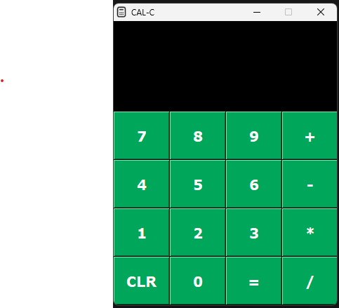

 

  

  <h3 align="center">CAL-C</h3>

  

    A simple GUI based python calculator to perform basic arithmetic operations.
     
     
    <a href="https://github.com/shubham3279/calc/issues">Report Bug</a>
    .
  

      

## About The Project

## Built With

Python 3 and Tkinter Library

## Usage
To use the application, just download the ".exe" file from this repository and run it on your local computer.

## Acknowledgements

* [Campus X](https://www.youtube.com/watch?v=owbU6WzIhhg&t=1533s&pp=ygUXY2FsY3VsYXRvciBhcHAgY2FtcHVzIHg%3D)
* [WsCubeTech](https://www.youtube.com/watch?v=bxuF8ucU_jY&pp=ygUVd3NjdWJldGVjaCAucHkgdG8gZXhl)
